# Doodle Image Recognition with Convolutional Neural Network

## Jasmine He

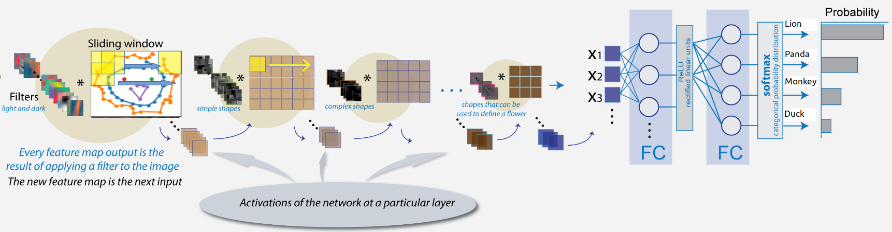

# Introduction
Google released the "Quick, Draw!"  data set as an exercise in AI education. The game functions by eliciting user-generated drawings of images representing categories like 'table' or 'lion'.

This project focuses on developing a better classification algorithm for the existing QuickDraw data set. Any advances in the processing of this kind of data will further general efforts at pattern recognition. It isn't difficult to imagine applying these techniques to computer vision.

# Objective
Our main objective is to use a convolutional neural network to classify images into various categories.

Secondary objectives include:
- Contrast convolutional neural networks with other kinds of simple machine learning models.
- Explore the most effective way to optimize the convolutional neural network.
- Understand how convolutional neural networks actually go about the business of parsing image data.

# Strategy
* Data Transformation
* Exploratory Data analysis
* Machine Learning Modeling
 * Naive Bayes Classifier
 * Decision Tree Classifier
 * Random Forest Classifier
 * Gradient Boosting Classifier
* Convolutional Neural Network
 * Model Comparison
 * Optimization Method Comparison
 * Bayesian Optimization Result
 * Optimized CNN Structure
 * Convolutional Layer Output Visualization

# Data Overview
#### 1. Total of 0.1 million drawings
#### 2. Total of 4 different categories: pandas, ducks, monkeys, and lions
#### 3. Each drawing is a timestamped vector which is tagged with metadata like the country where the player comes from.
The drawing feature is a list of strokes, with each stroke being a list of x,y values and a time value (for a total of three lists per stroke). This means that each drawing is a list of strokes which is a list of x,y,time values.

#### 4. Drawing examples

###### What does a duck look like?
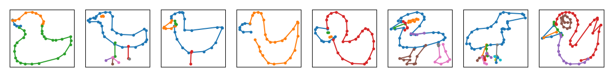

###### What does a lion look like?
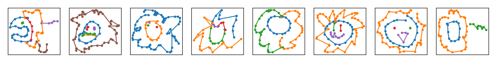

###### What does a monkey look like?
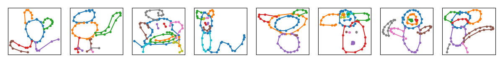

###### What does a panda look like?
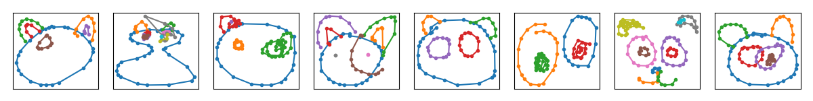

# Data Transformation

All the simplified drawings have been rendered into a 28x28 grayscale bitmap. These images were generated from the simplified data, but are aligned to the center of the drawing's bounding box rather than the top-left corner. Each of these resultant drawings are fuzzier than the originals because they are expressed in fewer dimensions.

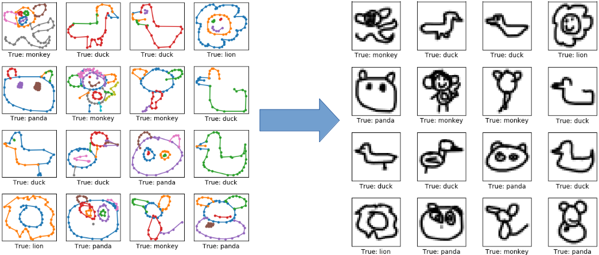

Figure 1. Flowchart for data transformation

# Exploratory Data Analysis

## 2D Embedding Plot
Principal Component Analysis works by creating linear transformations of data into
'principal components' which explain an equivalent amount of variance but in one fewer dimension. When this is done over a whole dataset the number of dimensions can be radically reduced without a concomitant loss in variance.

Since it is difficult to visualize high-dimensional data, we can use PCA to find the first two principal components and visualize the data in this new, two-dimensional space, with a single scatter-plot.

The plot below shows how the various categories of drawings (monkey, lion, panda, duck) are described by the two principal components for a random sub-sample of 5000 drawings.

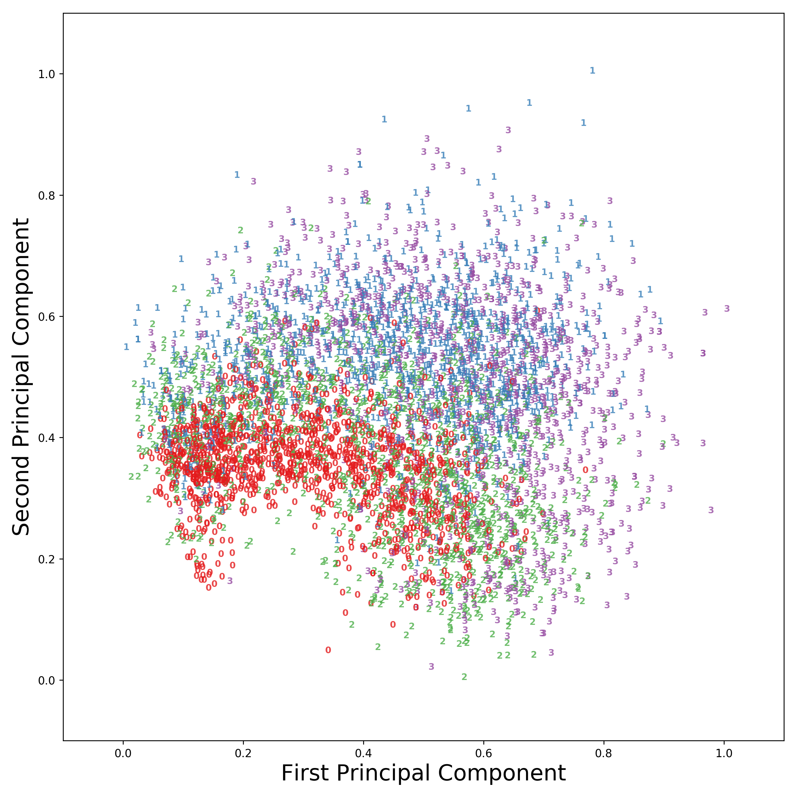

Figure 2. 2D embedding plot (class 0: duck, class 1: lion, class 2: monkey, class 3: panda)

## 3D Embeddding Plot
We can also use Principal component analysis to find the first three principal components, and visualize the data in this new, three-dimensional space.

Figure 3. 3D embedding plot (class 0: duck, class 1: lion, class 2: monkey, class 3: panda)

# Machine Learning Modeling
For the baseline machine learning models I applied a Naive Bayes Classifier, Decision Tree Classifier, Random Forest Classifier and Gradient Boosting Classifier to the 28*28 drawings (yielding 786 features per drawing).

### ROC Curves
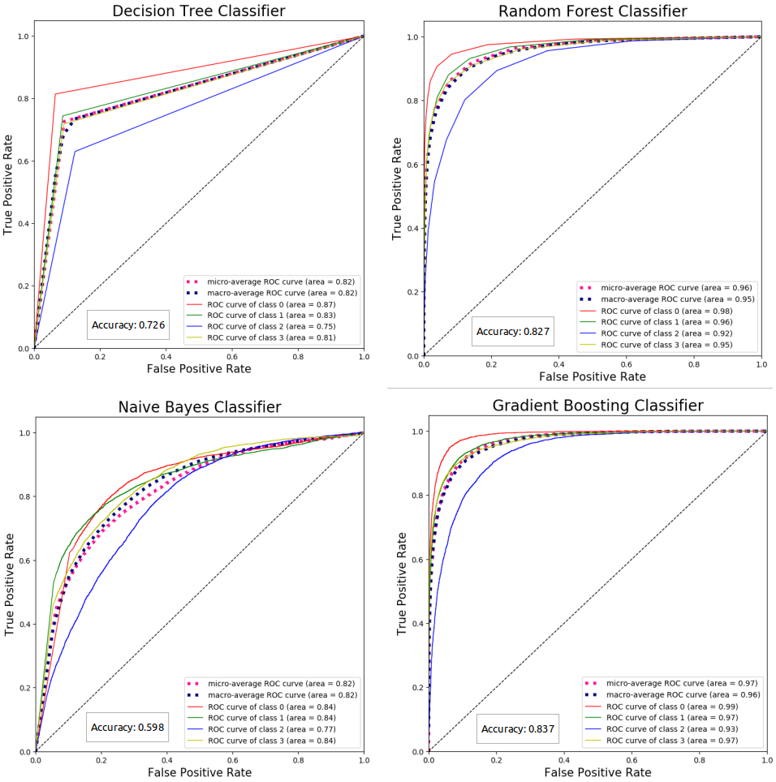

Figure 4. ROC curves of machine learning models (class 0: duck, class 1: lion, class 2: monkey, class 3: panda)

### Classification Reports
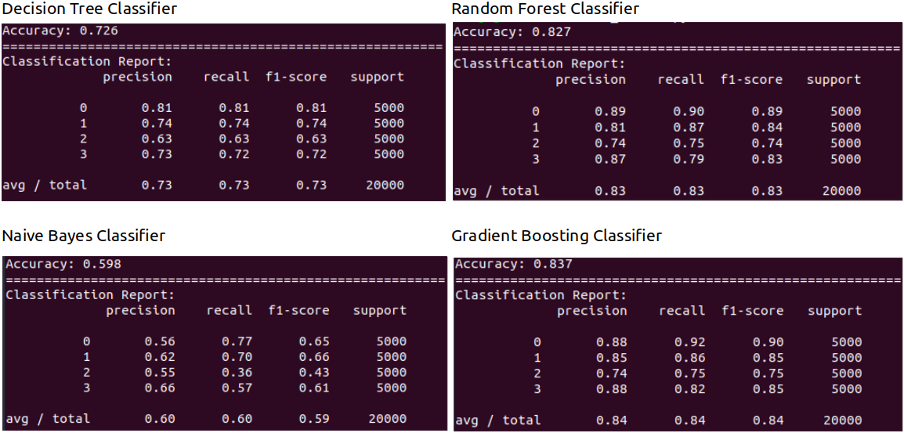

Figure 5. Classification reports of machine learning models (class 0: duck, class 1: lion, class 2: monkey, class 3: panda)

From the above classification report, we can see that the Gradient boosting model has the highest accuracy (83.7%). Moreover, all models performed best when classifying ducks (class 0) and worst when classifying monkeys (class 2).

# Convolutional Neural Network
## 1. Model Comparison
### Non-Optimized CNN (Accuracy: 84%) v.s. Optimized CNN (Accuracy: 94%)

The optimized Convolutional Neural Network achieved a classification accuracy of about 94%, compared to only 84% for the non-optimized Convolutional Neural Network.

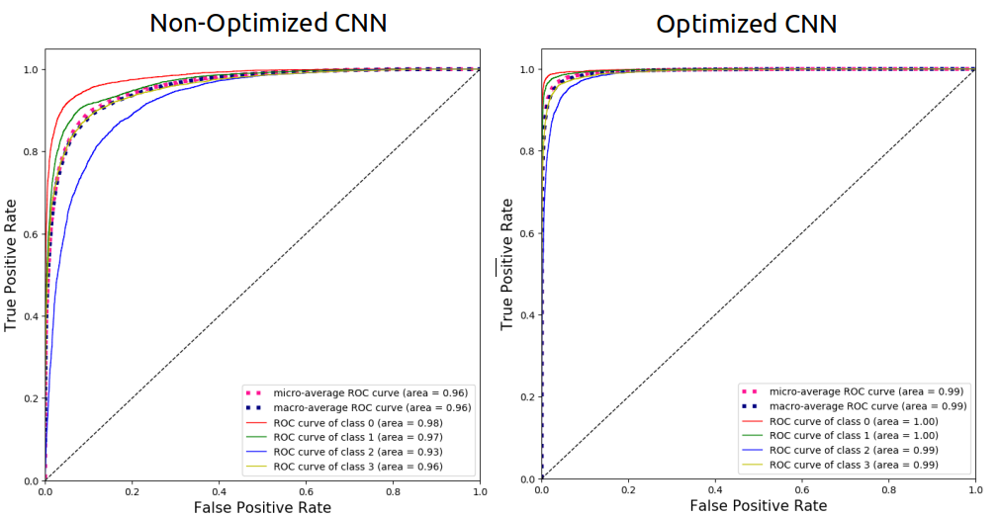

Figure 6. ROC curves of non-optimized CNN and optimized CNN (class 0: duck, class 1: lion, class 2: monkey, class 3: panda)

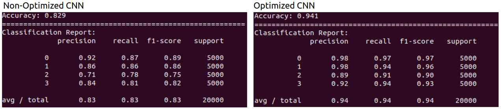

Figure 7. Classification reports of non-optimized CNN and optimized CNN (class 0: duck, class 1: lion, class 2: monkey, class 3: panda)

## 2. Hyperparameter Optimization Comparison

Convolutional Neural Networks afford the opportunity to tune a variety of parameters, usually called hyperparameters. Examples of hyperparameters include the number of hidden layers, the number of neurons per layer, which activation function is to be applied at each neuron, and so on.

In order to discover which combination of hyperparameters performs best, there are three methods of searching the space of possible hyperparameters, described below.

### Grid Search
Grid search divides each parameter's range of values into evenly spaced increments before using brute force to test each combination. It doesn't take long for this to become time-intensive because the number of combinations increases exponentially with the number of hyperparameters. This problem is known as the Curse of Dimensionality. With just 4 hyperparameters and 10 possible values for each, for example, there is a total of 10^4 parameter-combinations. Adding one more increases this to 10^5, a difference of an order of magnitude.

### Random Search
What if instead we simply try a randomly-chosen set of parameter-combinations? Though this drastically reduces the search time, there is also no guarantee that we'll find the optimum combination. As the number of parameters increases, in fact, the probability of finding this optimum tends toward zero.

### Bayesian Optimization
Bayesian optimization, on the other hand, builds a posterior distribution of candidate hyperparameter combinations which optimize the function. With more observation this posterior distribution becomes better, and the algorithm gains confidence in discriminating which parts of hyperparameter space are likely to be better than others.

Figure 8 shows Bayesian optimization finds a better optimum in a smaller number of steps than random search.

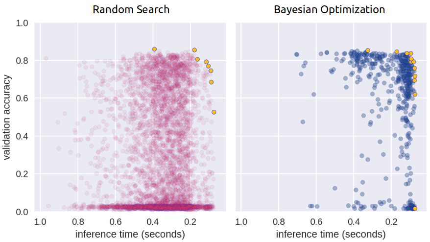

Figure 8. Chart for optimization comparison

## 3.  Bayesian Optimization Result
I used the sklearn-optimize library's built-in Bayesian optimization to find the optimized hyper-parameters.

### First Set of Hyperparameters
Below is the first set of hyper-parameters used to optimize the convolutional neural network:

    - The learning-rate of the optimizer
    - The number of fully-connected / dense layers
    - The number of nodes for each of the dense layers
    - Whether to use 'sigmoid' or 'relu' activation in all the layers

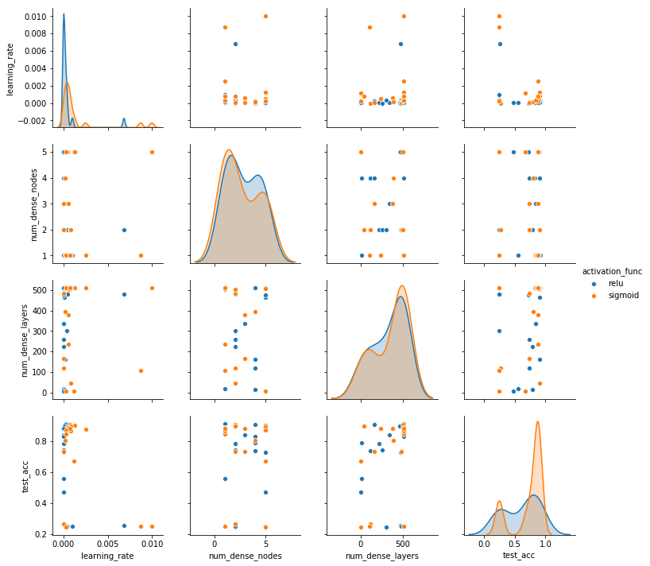

Figure 9. Visualization for the first set of hyper-parameter optimization result

As you can see from figure 9, on average 'relu' activation performs better than the 'sigmoid' activation, so I will choose relu activation for the model.

### Second Set of Hyperparameters
Below are the second set of hyper-parameters used to optimize the convolutional neural network:

    - The learning-rate of the optimizer
    - The number of fully-connected / dense layers
    - The number of nodes for each of the dense layers
    - Batch size
    - The number of epochs

##### Distribution for the Combination of the Hyperparameters
Figure 10 shows the distribution for the combination of the hyper-parameter used in the Bayesian optimization. Learning rate follows a gaussian distribution. The larger number of dense layers and the larger number of dense nodes for each layer improves the model validation accuracy.

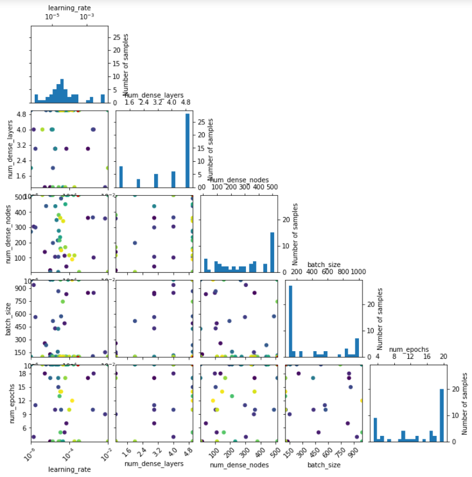

Figure 10. Distribution for the combination of the hyperparameters

##### Partial Dependence
Figure 11 shows which parameters affect the model the most -- with bigger partial dependency fluctuation corresponding to bigger effects. From the graph it's apparent that learning rate has the biggest impact on model performance, with the number of dense nodes coming in second.

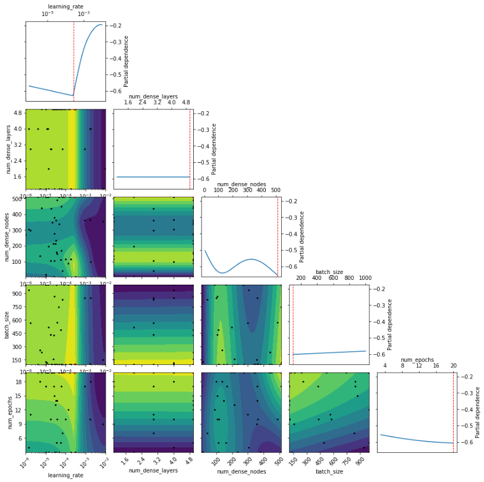

Figure 11. Partial dependence for the second set of hyperparameters

## 4. Prediction Visualization of the Optimized CNN

Figure 12 shows examples of images from the test-set that have been classified correctly. Figure 13 shows mis-classified examples. The true and predicted classes below each image.

#### Visualization of the Correct Predictions

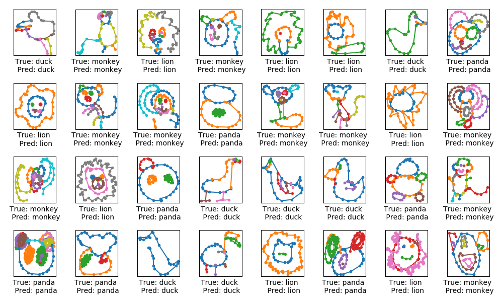

Figure 12. Subsamples for the correct predictions

#### Visualization of the Incorrect Predictions

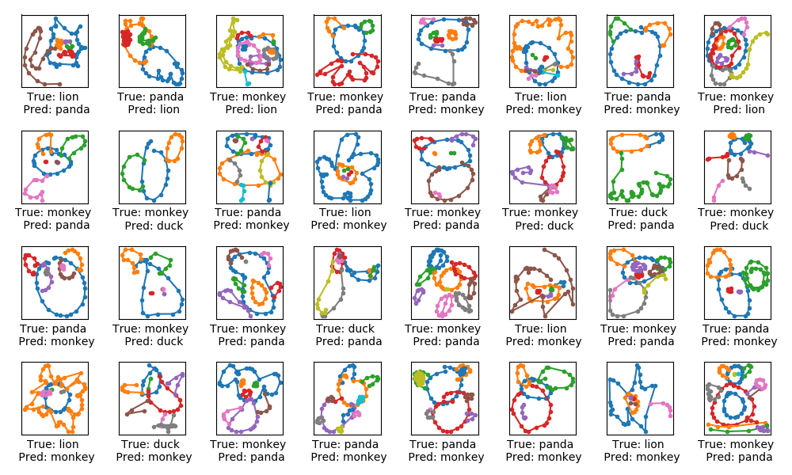

Figure 13. Subsamples for the incorrect predictions

## 5. Optimized Convolutional Neural Network Structure
Figure 14 shows roughly how the data flow in the best-performing Convolutional Neural Network. Each of the first two convolutional layers feeds their respective outputs into their respective max-pooling layer, which results in down-sampling. After the second max-pooling there follows five additional fully-connected layers, with the final layer being a softmax-classifier.

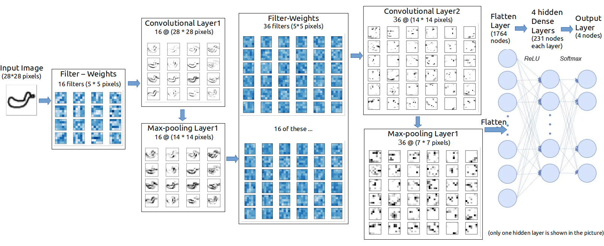

Figure 14. Flowchart for the optimized CNN

## 6. Convolutional Layer Output Visualization
The input image is processed in the first convolutional layer using the filter-weights. This results in 16 new images, one for each filter in the convolutional layer. The images are also down-sampled so the image resolution is decreased from 28x28 to 14x14.

These 16 smaller images are then processed in the second convolutional layer. There are 36 output channels so there are a total of 16 x 36 = 576 filters in the second convolutional layer. The resulting images are down-sampled again to 7x7 pixels.

The output of the second convolutional layer is 36 images of 7x7 pixels each. These are then flattened to a single vector of length 7 x 7 x 36 = 1764, which is used as the input to a fully-connected layer, but that is not shown here.

#### First Convolutional Layer
It is difficult to see from these images what the purpose of the convolutional filters might be. It appears that they have merely created several variations of the input image, as if light was shining from different angles and casting shadows in the image.

#### Second Convolutional Layer
From these images, it looks like the second convolutional layer might detect lines and patterns in the input images, which are less sensitive to local variations in the original input images.

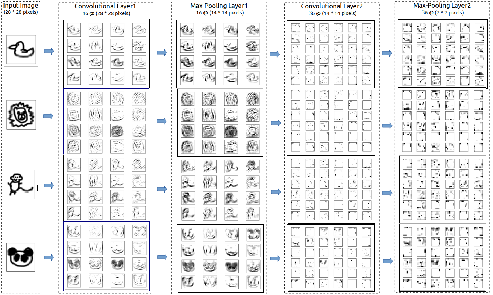

Figure 15. Convolutional layer outputs for the optimized CNN

# Conclusion
The Convolutional Neural Network is much better at recognizing doodles than the baseline machine learning models. The Convolutional Network is also much more complicated to implement, and, because of its complexity, its internal structure is semi-opaque and its failure modes hard to analyze.

It's also evident that, of the hyperparameter optimization search procedures available, Bayesian optimization is clearly superior.

# Future Work
- Consider including more categories in the model.
- Optimize more hyper-parameters with the Bayesian optimization. For example, the kernel-size and the number of filters in the convolutional layers, or the number of the convolutional layers
- Optimize the efficiency (number of parameters) of the convolutional neural network.
- Visualize outputs of the fully-connected layers to see how the model capture the features among different categories.

# Reference
- Peter, I., Frazier (2018). A Tutorial on Bayesian Optimization, arXiv:1807.02811
- https://sigopt.com/
- https://github.com/Hvass-Labs/TensorFlow-Tutorials

Copyright @ Jasmine He
